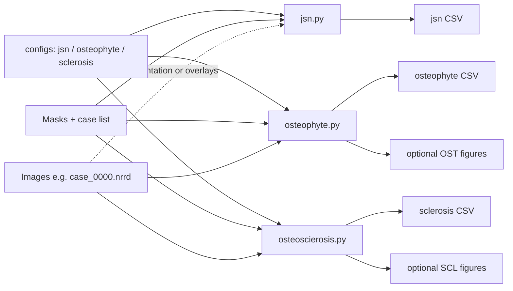

# KOA（Knee OA structural）

**English:** [README_EN.md](README_EN.md)

本目录包含 Python 包 **`koa`**，用于从影像与分割结果中提取膝关节骨关节炎（OA）相关的**结构**信息，主要分为三类：

- **关节间隙**：可测的间隙宽度等**数值**称 **JWD**（joint width distance，常用 mm）；基于间隙的**评估语境**（是否变窄等）称 **JSN**。文献常称 JSW，与本包 JWD 同指宽度；历史脚本/列名仍多含 ``jsn``，其中 ``*_mm`` 语义为 JWD。
- **软骨下骨硬化（SCL）**：由硬化区域分割计算占比等；
- **骨刺（OST）**：由骨刺相关分割计算占比等。

三者共同对应影像学 K–L 分级常用的要素（间隙变窄、骨刺、硬化）。**K–L 综合分级 / 自动诊断尚未在本包中实现。**

与 nnU-Net 训练、推理相关的脚本见同仓库 **`new_code/nnunet_pipeline`**。该目录为**与本主仓库一起提交的普通源码目录**（内含完整文件树），**不是** Git submodule；可直接当普通代码浏览与修改。

---

## 数据流（两条主线）

读代码时可以把流程拆成 **两条**：(1) 从分割与影像批量产出结构指标表（及可选配图）；(2) 在有人工标注时评估 JSN，并把多源 CSV 汇总成临床看板。

### （一）批量结构指标：JSN → 骨刺 → 硬化

典型顺序与 **`scripts/run_jsn_osteophyte_sclerosis.sh`** 一致：依次调用 `jsn.py` → `osteophyte.py` → `osteoscierosis.py`。输入路径与病例列表来自各 **`koa/configs/*.py`**（`mask_dir`、`image_dir`、元数据 CSV 等）；骨刺与硬化在 **批量 CSV + 出图** 模式下通常需要带 **`_0000` 通道后缀** 的影像文件名（与脚本内 `find_volume_path(..., require_channel_suffix=True)` 一致）。

| 步骤 | 脚本 | 读入 | 产出 |
|------|------|------|------|
| 1 | `scripts/jsn.py` | `jsn_config.py`：`mask_dir`、病例列表（`meta_data_csv` / glob）、必要时 `image_dir` 中带 `*_0000` 的影像（朝向） | 关节间隙 **CSV**（各腔室 mm、狭窄布尔等）；脚本模式**不出图**（与 `jsn.py` 注释一致）。 |
| 2 | `scripts/osteophyte.py` | `osteophyte_config.py`：左/右成对 mask（`case_L` / `case_R` 文件名主干）、叠图用 `image_dir` | **CSV**；若 `--batch-csv-and-figures` 则另存 **左/右成对** 配图（视是否有 `_0000` 影像）。 |
| 3 | `scripts/osteoscierosis.py` | `sclerosis_config.py`：每例 `mask_dir` 下单一 mask、叠图用 `image_dir` | **CSV**；若 `--batch-csv-and-figures` 则另存 **每例双膝** 硬化叠图。 |

环境变量可覆盖输出位置，见 `run_jsn_osteophyte_sclerosis.sh` 文件头：`JSN_OUTPUT`、`OST_OUTPUT_CSV`、`OST_FIGURE_DIR`、`SCL_OUTPUT_CSV`、`SCL_FIGURE_DIR`。无界面服务器可设 `MPLBACKEND=Agg`、`QUIET=1`。

**一键顺序执行**（与本节步骤表顺序一致）：

```bash
chmod +x scripts/run_jsn_osteophyte_sclerosis.sh
./scripts/run_jsn_osteophyte_sclerosis.sh
# 可选：QUIET=1 MPLBACKEND=Agg ./scripts/run_jsn_osteophyte_sclerosis.sh
```



### （二）评估与汇总：JSN 标注 + 临床看板

| 步骤 | 入口 | 作用 |
|------|------|------|
| A | `scripts/jsn_eval.py`（与 `jsn_eval.ipynb` 逻辑相同） | 将流水线得到的 JSN/JWD 表与人工标注对比，搜索各区室 **狭窄阈值**；`--label-dir` 下需有 `jwd_result_w_label.csv` 或脚本支持的 xlsx（见 `jsn_eval.py`）。依赖 **scikit-learn**。 |
| B | `scripts/koa_clinical_dashboard.py` | **`merge`**：按 `case_id` 合并 JSN、骨刺、硬化三张结果表；**`plot`**：单例 2×2 临床拼图（见脚本 `--help`）。 |

（以上两步默认你已按「（一）」产出或等价路径下的三张结果 CSV。）

---

## 环境与依赖（先前使用记录 + 推荐搭建）

**先前上下文：** 仓库内 `jsn_eval.ipynb` 等保存的内核名为 **`image_analysis_env`**，Python **3.11**。该名称仅为当时的 Conda/venv 习惯命名，并非必须；你可任意命名新环境。

**推荐步骤（Conda 示例）：**

```bash
# 1) 新建环境（Python 3.11 与先前笔记本一致；3.10/3.12 通常也可）
conda create -n koa python=3.11 -y
conda activate koa

# 2) 进入本目录并安装依赖（将 <REPO_ROOT> 换成你机器上的仓库根目录）
cd <REPO_ROOT>/new_code/KOA
pip install -r requirements.txt
```

**仅用 pip（无 Conda）时：**

```bash
python3.11 -m venv .venv
source .venv/bin/activate   # Windows: .venv\Scripts\activate
pip install -U pip
pip install -r requirements.txt
```

安装完成后，继续下一节设置 **`PYTHONPATH`**。

---

## 目录结构（`koa/`）

| 模块 | 作用 |
|------|------|
| **`jwd`** | 根据 2D 股骨–胫骨标签图做 **JSN** 评估；输出中的 mm 量为 **JWD**（`measure_knee_joint_space`、方向、骨缘、内外侧划分等） |
| **`osteosclerosis`** | 硬化：``compute_sclerosis_ratio.py``（四分腔：各腔室 **专用硬化类** ÷ **该腔室骨段**；另保留旧版「单侧硬化总和÷骨并集」API） |
| **`osteophyte`** | 骨刺：``koa/osteophyte/compute_osteophyte_ratio.py``（骨刺相对全髌像素，记作 OST/PAT；竖直中线分幅或左 / 右文件；记法见该文件顶部） |
| **`configs`** | 例如 `jsn_config.py`（关节间隙批量路径等） |
| **`utils`** | `sitk_utils`、`orientation`（NRRD 与解剖轴）、`bilateral_viz`（双侧结果叠图） |
| **`dashboard`** | 多源 CSV 合并与临床拼图（`merge_tables`、`clinical_plot`；CLI 见 `koa_clinical_dashboard.py`） |

命令行脚本（与各笔记本对应）见 **`scripts/`**；示例与交互：`notebooks/`。一键跑通三条批量管线见 **`scripts/run_jsn_osteophyte_sclerosis.sh`**。

---

## 环境变量与导入（PYTHONPATH、示例命令、导入、Jupyter）

将 **`KOA`** 项目根目录（本 README 所在目录，且其下包含 `koa` 包目录）加入 `PYTHONPATH`：

```bash
cd <REPO_ROOT>/new_code/KOA
export PYTHONPATH="$PWD:$PYTHONPATH"

# 关节间隙批量测量（对应 jsn.ipynb）
python scripts/jsn.py --output /tmp/jsn_results.csv

# JSN 评估与最优阈值（对应 jsn_eval.ipynb，需 scikit-learn）
python scripts/jsn_eval.py --label-dir /path/to/jsn_results

# 硬化：仅批量写 CSV（路径见 koa/configs/sclerosis_config.py；与笔记本相同入口 ``sclerosis_results_dataframe_from_config``）
python scripts/osteoscierosis.py --csv-only

# 硬化单例叠图（对应 osteoscierosis.ipynb）
python scripts/osteoscierosis.py --image /path/case_0000.nrrd --mask /path/case.nrrd --out /tmp/scl.png --no-show

# 骨刺：仅批量写 CSV（L/R 成对 mask，见 osteophyte_config）
python scripts/osteophyte.py --csv-only

# 骨刺：受试者 base id，从 config 的 image_dir / mask_dir 读 base_L、base_R
python scripts/osteophyte.py --case-id KOA01 --out /tmp/ost.png --no-show

# 一键：JSN → 骨刺 → 硬化（输出路径可由各 config 或环境变量覆盖，见脚本注释）
./scripts/run_jsn_osteophyte_sclerosis.sh

```

推荐子包导入（依赖清晰）：

```python
from koa.jwd import measure_knee_joint_space, direction, edges, jsn, compartments
from koa.osteophyte import osteophyte_ratios_lr_files_auto
from koa.osteosclerosis import sclerosis_results_dataframe_from_config
from koa.dashboard import plot_clinical_koa_dashboard
```

也可惰性从顶层导入等价符号，例如 ``from koa import measure_knee_joint_space``（见 ``koa/__init__.py`` 中 ``__all__``）。

在 **Jupyter** 中：将 `KNEE_PKG_ROOT` 设为上述 **`KOA` 项目根目录**（与 `notebooks/` 同级、`koa/` 所在目录），`sys.path.insert(0, str(KNEE_PKG_ROOT))` 后再 `from koa...`。

### `scripts/` 一览

| 文件 | 说明 |
|------|------|
| `jsn.py` | 关节间隙批量测量 |
| `jsn_eval.py` | JSN 与标注对比、阈值搜索 |
| `osteophyte.py` | 骨刺：仅 CSV、单例图或批量 CSV+图 |
| `osteoscierosis.py` | 硬化：仅 CSV、单例图或批量 CSV+图 |
| `koa_clinical_dashboard.py` | 合并三张 CSV 或单例临床拼图 |
| `run_jsn_osteophyte_sclerosis.sh` | 顺序执行上述前三条 CLI |

---

## 配置

- **`koa/configs/jsn_config.py`**：关节间隙批量路径、`output_csv`、病例枚举、`direction_source`（`mask` 与 `dicom` + `meta_data_csv`）。
- **`koa/configs/osteophyte_config.py`**：`mask_dir` / `image_dir` / `output_csv`；`osteophyte_left_suffix` / `osteophyte_right_suffix`（默认 ``_L`` / ``_R``）；`volume_extensions` / `file_type`；`label_mapping` 推荐键 ``Patella`` / ``Patella_Osteophyte``（与 nnU-Net 标签表一致时请同步改名）；`patella_label_ids`（默认 `[1,2]`，**每张图全图**内少像素标签 = 骨刺，两类之和 = 髌骨）；`meta_data_csv`（列为 **base** id，不含 `_L`/`_R` 后缀；列名见 `case_id_column` 或回退 `case_id` / `patient_name`）。
- **`koa/configs/sclerosis_config.py`**：同上 IO 字段；**仅**维护 `label_mapping`（类名 → ID）。股骨 / 胫骨 / 硬化分组由 `sclerosis_label_sets_from_mapping` 从类名解析。CSV 中为 **右/左股骨硬化比、右/左胫骨硬化比**（及像素计数）。

笔记本会从上述 config **读默认路径**；改 config 即可与 nnU-Net `dataset.json` 对齐。

---

## 依赖一览（与 `requirements.txt` 一致）

| 包 | 用途 |
|----|------|
| numpy, scipy | 数组与距离计算 |
| pandas | 表格与 `jsn_eval` 读入标注 |
| matplotlib | 笔记本与 `osteophyte` / `osteoscierosis` 脚本出图 |
| opencv-python-headless | `jwd` 轮廓（无 GUI 依赖，服务器友好） |
| SimpleITK | NRRD/NIfTI 读写 |
| pydicom | `direction_source="dicom"` 时读 DICOM 朝向 |
| scikit-learn | `jsn_eval.py` 指标与阈值搜索 |
| openpyxl | `jsn_eval` 读取 `.xlsx` 标注表 |

---

## 可视化笔记本说明（`notebooks/`）

| 文件名 | 内容 | 对应 CLI |
|--------|------|----------|
| `jsn.ipynb` | 读 `jsn_config`，逐例调用 `measure_knee_joint_space`，与 `scripts/jsn.py` 同主线 | `scripts/jsn.py` |
| `jsn_eval.ipynb` | 读带标注表 + JSN 结果，指标与最优 `jsn_narrow_mm` 搜索，与 `jsn_eval.py` 一致 | `scripts/jsn_eval.py` |
| `osteophyte.ipynb` | **骨刺**：左/右各一图（`base_L`/`base_R`），并排叠图、OST/PAT 占比、config 驱动批量 CSV | `scripts/osteophyte.py` |
| `osteoscierosis.ipynb` | **硬化**：股骨/胫骨四分腔叠图与批量 CSV，与 `osteoscierosis.py` 一致 | `scripts/osteoscierosis.py` |

文件名 `osteoscierosis.ipynb` 与脚本 `osteoscierosis.py` 拼写相同（历史笔误，二者成对使用即可）。

---

## 比例含义（默认约定）

- **硬化（SCL）**：四分腔——**右股骨硬化/右股骨**、**右胫骨硬化/右胫骨**、左股骨、左胫骨（各腔室独立分子；`label_mapping` 通过类名解析）。CLI 若传入 `--scl-r`/`--bone-r` 等，则仍走旧的「单侧硬化总和 vs 骨并集」单比例逻辑。
- **骨刺（OST）**：**左、右各一张** 图（文件名 `{base}_L` / `{base}_R`）。每张 **全图** 内用配置中的 `patella_label_ids`（两标签）统计：**较少像素 = 骨刺**，两类之和 = 髌骨分母；`plot_lr_knee_images_overlay` 等在 **同一 figure** 并排显示两侧占比。打平手时默认 **较大标签 ID 视为骨刺**（`tie_osteophyte_is_higher_id`）。

若体位或标签定义不同，请改对应 **config** 或传参。
