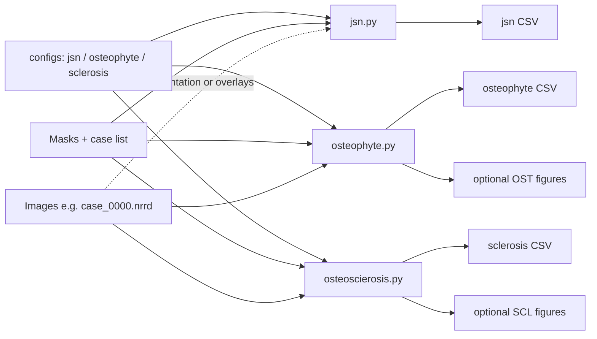

# KOA — Knee OA structural metrics

**Chinese:** [README.md](README.md) (same structure as this file; section-by-section counterpart)

This folder contains the Python package **`koa`**, which extracts **structural** knee osteoarthritis (OA) information from images and segmentation masks. There are three main metric families:

- **Joint space**: measurable gap widths are **JWD** (joint width distance, often in mm); **JSN** is the evaluation framing (narrowing vs not). Literature often says JSW; this repo’s historical column names still contain `jsn`, and `*_mm` columns are JWD.
- **Subchondral sclerosis (SCL)**: ratios from sclerosis segmentations.
- **Osteophytes (OST)**: ratios from osteophyte-related segmentations.

Together these align with common K–L imaging elements (joint space narrowing, osteophytes, sclerosis). **Combined K–L grading / automatic diagnosis is not implemented here.**

For nnU-Net training and inference scripts, see **`new_code/nnunet_pipeline`** in the same repository (a normal source tree, not a Git submodule).

---

## Data flows (two main lines)

Think of the repo as **two connected flows**: (1) batch structural tables (and optional figures) from segmentations and images; (2) when human labels exist, evaluate JSN and merge multiple CSVs into a clinical board.

### (1) Batch structural metrics: JSN → osteophyte → sclerosis

The usual order matches **`scripts/run_jsn_osteophyte_sclerosis.sh`**: `jsn.py` → `osteophyte.py` → `osteoscierosis.py`. Paths and case lists come from **`koa/configs/*.py`** (`mask_dir`, `image_dir`, metadata CSV, etc.). For osteophyte and sclerosis **batch CSV + figures**, filenames typically need the **`_0000` channel suffix** (same as `find_volume_path(..., require_channel_suffix=True)` in the scripts).

| Step | Script | Reads | Writes |
|------|--------|--------|--------|
| 1 | `scripts/jsn.py` | `jsn_config.py`: `mask_dir`, case list (`meta_data_csv` / glob), optional `image_dir` with `*_0000` when orientation needs it | **CSV**: per-compartment JWD (mm), narrow flags, etc. **No figure mode** in this script (per `jsn.py` docstring). |
| 2 | `scripts/osteophyte.py` | `osteophyte_config.py`: L/R mask pairs (`case_L` / `case_R` stems), `image_dir` for overlays | **CSV**; with `--batch-csv-and-figures`, optional **L/R pair figures** (when `*_0000` images exist). |
| 3 | `scripts/osteoscierosis.py` | `sclerosis_config.py`: one mask per case under `mask_dir`, `image_dir` for overlays | **CSV**; with `--batch-csv-and-figures`, optional **per-case bilateral sclerosis overlays**. |

Environment variables override outputs (see `run_jsn_osteophyte_sclerosis.sh` header): `JSN_OUTPUT`, `OST_OUTPUT_CSV`, `OST_FIGURE_DIR`, `SCL_OUTPUT_CSV`, `SCL_FIGURE_DIR`. On headless servers use e.g. `MPLBACKEND=Agg`, `QUIET=1`.

**One-shot runner** (same order as the step table above):

```bash
chmod +x scripts/run_jsn_osteophyte_sclerosis.sh
./scripts/run_jsn_osteophyte_sclerosis.sh
# Optional: QUIET=1 MPLBACKEND=Agg ./scripts/run_jsn_osteophyte_sclerosis.sh
```



### (2) Evaluation and aggregation: JSN labels + clinical dashboard

| Step | Entry | Role |
|------|--------|------|
| A | `scripts/jsn_eval.py` (same logic as `jsn_eval.ipynb`) | Compare pipeline JSN/JWD tables to human labels; search per-compartment **narrowing thresholds**; under `--label-dir` expect `jwd_result_w_label.csv` or supported `.xlsx` (see `jsn_eval.py`). Requires **scikit-learn**. |
| B | `scripts/koa_clinical_dashboard.py` | **`merge`**: join JSN + osteophyte + sclerosis CSVs on `case_id`. **`plot`**: single-subject 2×2 clinical board (see script `--help`). |

(Steps A–B assume you already produced the three result CSVs from flow (1), or equivalent paths in configs.)

---

## Environment and dependencies (prior context + recommended setup)

**Prior context:** notebooks such as `jsn_eval.ipynb` were saved with kernel **`image_analysis_env`**, Python **3.11**. That name is optional; any compatible env name is fine.

**Recommended (Conda example):**

```bash
# 1) New env (3.11 matches prior notebooks; 3.10/3.12 usually work too)
conda create -n koa python=3.11 -y
conda activate koa

# 2) Install deps (<REPO_ROOT> = your repo root)
cd <REPO_ROOT>/new_code/KOA
pip install -r requirements.txt
```

**pip only (no Conda):**

```bash
python3.11 -m venv .venv
source .venv/bin/activate   # Windows: .venv\Scripts\activate
pip install -U pip
pip install -r requirements.txt
```

After installation, set **`PYTHONPATH`** in the next section.

---

## Package layout (`koa/`)

| Module | Role |
|--------|------|
| **`jwd`** | **JSN** assessment from 2D femur–tibia label maps; mm outputs are **JWD** (`measure_knee_joint_space`, orientation, bone edges, medial/lateral compartments, etc.). |
| **`osteosclerosis`** | Sclerosis: `compute_sclerosis_ratio.py` (four compartments: compartment-specific **sclerosis** ÷ **bone in that compartment**; legacy API “single-side sclerosis sum ÷ bone union” is still available). |
| **`osteophyte`** | Osteophytes: `koa/osteophyte/compute_osteophyte_ratio.py` (osteophyte vs whole patella pixels, OST/PAT; vertical midline split or separate L/R files; notation at top of that file). |
| **`configs`** | e.g. `jsn_config.py` (batch paths for joint space). |
| **`utils`** | `sitk_utils`, `orientation` (NRRD and anatomy axes), `bilateral_viz` (bilateral overlays), case-list helpers. |
| **`dashboard`** | Merge multi-source CSVs and clinical figures (`merge_tables`, `clinical_plot`; CLI: `koa_clinical_dashboard.py`). |

CLI scripts (paired with notebooks) live under **`scripts/`**; demos and interaction under **`notebooks/`**. One-shot batch for all three metrics: **`scripts/run_jsn_osteophyte_sclerosis.sh`**.

---

## PYTHONPATH, CLI examples, imports, Jupyter

Add the **KOA project root** (this README’s directory, containing the `koa` package) to `PYTHONPATH`:

```bash
cd <REPO_ROOT>/new_code/KOA
export PYTHONPATH="$PWD:$PYTHONPATH"

# Joint space batch (matches jsn.ipynb)
python scripts/jsn.py --output /tmp/jsn_results.csv

# JSN evaluation + thresholds (matches jsn_eval.ipynb; needs scikit-learn)
python scripts/jsn_eval.py --label-dir /path/to/jsn_results

# Sclerosis: CSV only (paths in koa/configs/sclerosis_config.py; same entry as notebook `sclerosis_results_dataframe_from_config`)
python scripts/osteoscierosis.py --csv-only

# Sclerosis: single-case overlay (matches osteoscierosis.ipynb)
python scripts/osteoscierosis.py --image /path/case_0000.nrrd --mask /path/case.nrrd --out /tmp/scl.png --no-show

# Osteophyte: CSV only (L/R mask pairs; see osteophyte_config)
python scripts/osteophyte.py --csv-only

# Osteophyte: subject base id; reads base_L / base_R from config image_dir / mask_dir
python scripts/osteophyte.py --case-id KOA01 --out /tmp/ost.png --no-show

# One command: JSN → osteophyte → sclerosis (override via each config or env vars in script header)
./scripts/run_jsn_osteophyte_sclerosis.sh
```

Recommended subpackage imports:

```python
from koa.jwd import measure_knee_joint_space, direction, edges, jsn, compartments
from koa.osteophyte import osteophyte_ratios_lr_files_auto
from koa.osteosclerosis import sclerosis_results_dataframe_from_config
from koa.dashboard import plot_clinical_koa_dashboard
```

You can also lazy-import from the top level, e.g. `from koa import measure_knee_joint_space` (see `koa/__init__.py` `__all__`).

**In Jupyter:** set `KNEE_PKG_ROOT` to the **KOA project root** (same level as `notebooks/`, where `koa/` lives), then `sys.path.insert(0, str(KNEE_PKG_ROOT))` before `from koa...`.

### `scripts/` index

| File | Purpose |
|------|---------|
| `jsn.py` | Batch joint-space measurement |
| `jsn_eval.py` | JSN vs labels, threshold search |
| `osteophyte.py` | Osteophyte: CSV only, single-case figure, or batch CSV + figures |
| `osteoscierosis.py` | Sclerosis: CSV only, single-case figure, or batch CSV + figures |
| `koa_clinical_dashboard.py` | Merge three CSVs or single-subject clinical board |
| `run_jsn_osteophyte_sclerosis.sh` | Runs the first three CLIs in order |

---

## Configuration

- **`koa/configs/jsn_config.py`**: joint-space batch paths, `output_csv`, case enumeration, `direction_source` (`mask` vs `dicom` + `meta_data_csv`).
- **`koa/configs/osteophyte_config.py`**: `mask_dir` / `image_dir` / `output_csv`; `osteophyte_left_suffix` / `osteophyte_right_suffix` (default `_L` / `_R`); `volume_extensions` / `file_type`; `label_mapping` keys e.g. `Patella` / `Patella_Osteophyte` (keep names in sync with nnU-Net `dataset.json`); `patella_label_ids` (default `[1,2]`: **whole-image** fewer pixels = osteophyte, sum of both = patella denominator); `meta_data_csv` with **base** ids (no `_L`/`_R`; column from `case_id_column` or fallback `case_id` / `patient_name`).
- **`koa/configs/sclerosis_config.py`**: same IO fields; maintain **`label_mapping` only** (class name → ID). Femur/tibia/sclerosis groups come from names via `sclerosis_label_sets_from_mapping`. CSV columns include **right/left femur and tibia sclerosis ratios** (and pixel counts).

Notebooks read default paths from these configs; edit configs to match nnU-Net `dataset.json`.

---

## Dependencies (same as `requirements.txt`)

| Package | Use |
|---------|-----|
| numpy, scipy | Arrays and distances |
| pandas | Tables and `jsn_eval` label loading |
| matplotlib | Notebooks and `osteophyte` / `osteoscierosis` figures |
| opencv-python-headless | Contours in `jwd` (no GUI; server-friendly) |
| SimpleITK | NRRD/NIfTI I/O |
| pydicom | DICOM orientation when `direction_source="dicom"` |
| scikit-learn | Metrics and threshold search in `jsn_eval.py` |
| openpyxl | `.xlsx` label tables in `jsn_eval` |

---

## Notebooks (`notebooks/`)

| Notebook | Content | Matching CLI |
|----------|---------|----------------|
| `jsn.ipynb` | Read `jsn_config`, iterate cases, call `measure_knee_joint_space` — same main line as `scripts/jsn.py`. | `scripts/jsn.py` |
| `jsn_eval.ipynb` | Labeled table + JSN results, metrics, optimal `jsn_narrow_mm` search — same as `jsn_eval.py`. | `scripts/jsn_eval.py` |
| `osteophyte.ipynb` | **Osteophyte**: one image per side (`base_L` / `base_R`), side-by-side overlay, OST/PAT %, batch CSV via config. | `scripts/osteophyte.py` |
| `osteoscierosis.ipynb` | **Sclerosis**: four-compartment femur/tibia overlays and batch CSV — same as `osteoscierosis.py`. | `scripts/osteoscierosis.py` |

The filename `osteoscierosis.ipynb` matches script `osteoscierosis.py` (historical spelling; use them as a pair).

---

## Default ratio conventions

- **SCL (sclerosis)**: four compartments — **right femur sclerosis / right femur**, **right tibia sclerosis / right tibia**, left femur, left tibia (separate numerators per compartment; `label_mapping` parsed by class names). If you pass CLI flags like `--scl-r` / `--bone-r`, the legacy **single-side sclerosis sum vs bone union** path is used instead.
- **OST (osteophyte)**: **one image per knee** (`{base}_L` / `{base}_R`). Per image, `patella_label_ids` defines two labels: **fewer pixels = osteophyte**, sum of both = patella denominator; `plot_lr_knee_images_overlay` shows both sides’ percentages in **one figure**. Ties default to **higher label id = osteophyte** (`tie_osteophyte_is_higher_id`).

If pose or label definitions differ, change the relevant **config** or CLI arguments.
